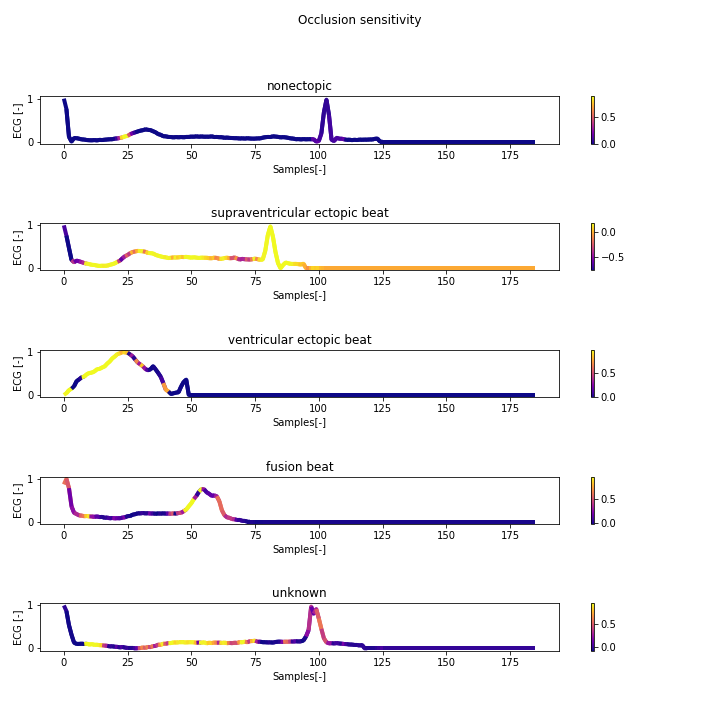
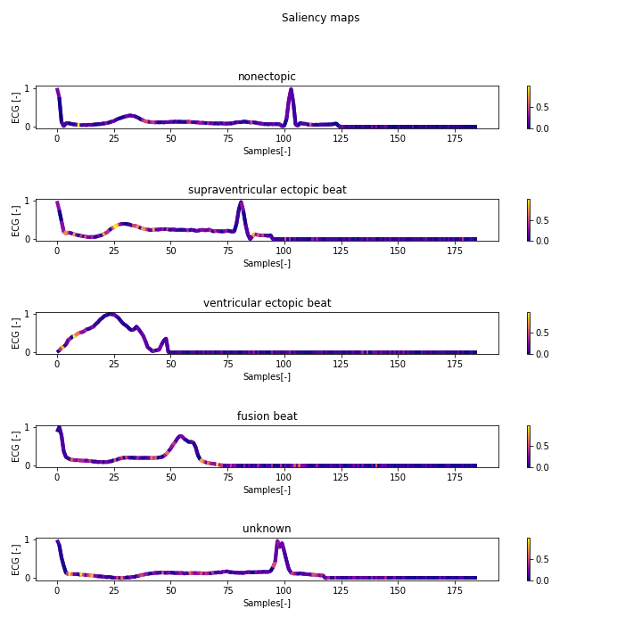
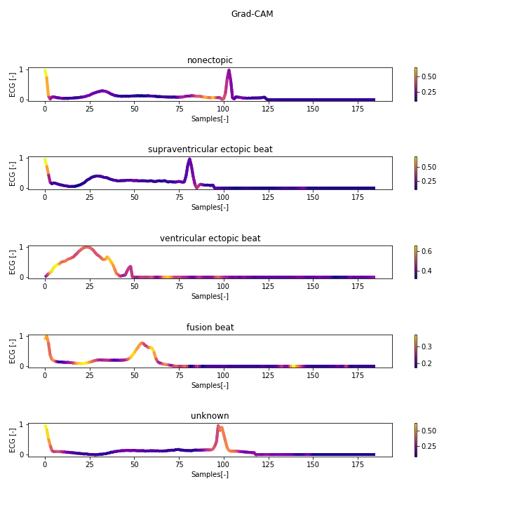

# SignalScreen

Set of functions for **visual interpretation of 1D neural networks compatible with Tensorflow 2.0**.
The set provides 3 different approaches:
* [Occlusion sensitivity](https://arxiv.org/abs/1311.2901)
* [Saliency maps](https://arxiv.org/abs/1312.6034)
* [Grad-CAM](https://arxiv.org/abs/1610.02391)

## Installation

Meanwhile, the library is not available with pip install. Download the two files "_signal_screen.py_" and 
"_signal_screen_tools.py_", and you should be good to go. 

**Tested for configuration:**
* Tensorflow 2.3.2
* Python 3.6.7

**Required libraries:**
* [Tensorflow 2.x.x](https://www.tensorflow.org/install)
* [NumPy](https://numpy.org/install/)
* [Matplotlib](https://matplotlib.org/users/installing.html)
* [SciPy](https://www.scipy.org/)
* [tqdm](https://github.com/tqdm/tqdm) - optional

## Usage
### Occlusion sensitivity
```python
import signal_screen
import signal_screen_tools
import matplotlib.pyplot as plt
import numpy as np

# preprocess your data
# create your model

number_of_classes = 5

# set up chart by yourself
fig, axs = plt.subplots(nrows=number_of_classes, ncols=1)
fig.suptitle("Occlusion sensitivity")
fig.tight_layout()
fig.set_size_inches(10, 10)
axs = axs.ravel()

# iterate through your data, which you want to visualise
for c, row, ax, title in zip(range(number_of_classes), examples_to_visualise, axs, titles):
    # pass model and input for the model - multiple inputs could be done by 
    # e.g. np.expand_dims(X_test[5:10, :], axis=(2))
    sensitivity, _ = signal_screen.calculate_occlusion_sensitivity(model=model, # your model
                                                                   # input of the model
                                                                   data=np.expand_dims(X_test[row, :], axis=(0, 2)), 
                                                                   c=c,  # index of class to visualise
                                                                   number_of_zeros=[15])  # length of window 

    # create gradient plot - inner tool for gradient chart
    signal_screen_tools.plot_with_gradient(ax=ax, y=X_test[row, :].ravel(), gradient=sensitivity[0], title=title)

plt.show()
```



### Saliency maps

```python
# the same imports and preprocessing
number_of_classes = 5

# set up chart by yourself
fig, axs = plt.subplots(nrows=number_of_classes, ncols=1)
fig.suptitle("Saliency maps")
fig.tight_layout()
fig.set_size_inches(10, 10)
axs = axs.ravel()

# iterate through your data, which you want to visualise
for c, row, ax, title in zip(range(number_of_classes), examples_to_visualise, axs, titles):
    # pass model and input for the model - multiple inputs could be done by 
    # e.g. np.expand_dims(X_test[5:10, :], axis=(2))
    saliency_map = signal_screen.calculate_saliency_map(model=model, # your model
                                                        # input of the model
                                                        data=np.expand_dims(X_test[row, :], axis=0),
                                                        c=c)  # index of class to visualise
    # create gradient plot - inner tool for gradient chart
    signal_screen_tools.plot_with_gradient(ax=ax, y=X_test[row, :].ravel(), gradient=saliency_map, title=title)

plt.show()
```



### Grad-CAM
```python
# the same imports and preprocessing
number_of_classes = 5

# set up chart by yourself
fig, axs = plt.subplots(nrows=number_of_classes, ncols=1)
fig.suptitle("Grad-CAM")
fig.tight_layout()
fig.set_size_inches(10, 10)
axs = axs.ravel()

# iterate through your data, which you want to visualise
for c, row, ax, title in zip(range(number_of_classes), examples_to_visualise, axs, titles):
    # pass model and input for the model - multiple inputs could be done by 
    # e.g. np.expand_dims(X_test[5:10, :], axis=(2))
    grad_cam = signal_screen.calculate_grad_cam(model=model,
                                                # in case of one input, expand dims is required with axis 0
                                                data=X_test[row:row+5, :], 
                                                c=c) # index of class to visualise
                                                
    grad_cam = np.average(grad_cam, axis=0)  # averaging outputs of grad-cam
    
    # create gradient plot - inner tool for gradient chart
    signal_screen_tools.plot_with_gradient(ax=ax, y=X_test[row, :].ravel(), gradient=grad_cam, title=title)

plt.show()
```




### [For whole example and explanation visit jupiter notebook "example.ipynb"](example.ipynb)

## References:
* [Occlusion sensitivity - "Visualizing and Understanding Convolutional Networks" by Matthew D Zeiler, Rob Fergus](https://arxiv.org/abs/1311.2901)
* [Saliency maps - "Deep Inside Convolutional Networks: Visualising Image Classification Models and Saliency Maps" by Karen Simonyan, Andrea Vedaldi, Andrew Zisserman](https://arxiv.org/abs/1312.6034)
* [Grad-CAM - "Grad-CAM: Visual Explanations from Deep Networks via Gradient-based Localization" by Ramprasaath R. Selvaraju, Michael Cogswell, Abhishek Das, Ramakrishna Vedantam, Devi Parikh, Dhruv Batra](https://arxiv.org/abs/1610.02391)

## Other useful libraries for images and other models:
* [SHAP](https://github.com/slundberg/shap) - A game theoretic approach to explain the output of any machine learning model
* [tf-explain](https://github.com/sicara/tf-explain) - Interpretability Methods for tf.keras models with Tensorflow 2.x
* [tf-keras-vis](https://github.com/keisen/tf-keras-vis) - Neural network visualization toolkit for tf.keras

